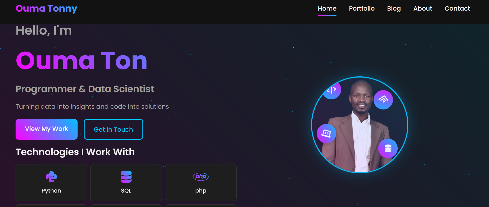

# Ouma Tonny - Personal Portfolio Website

This is a comprehensive personal portfolio website for Ouma Tonny, a Programmer and Data Scientist. It's designed to showcase projects, share blog posts, and provide information about his skills and services. The project includes a full-featured admin panel for managing content.



## Live Demo

You can view a live demo of the portfolio at:  [https://oumatonny.chisne.co.ke/](https://oumatonny.chisne.co.ke/ "https://oumatonny.chisne.co.ke/") 

Features

* **Dynamic Portfolio:** Showcase your projects with images, descriptions, tags, and links.
* **Featured Projects:** Highlight your best work on the home page.
* **Blog System:** Write and publish articles with a built-in WYSIWYG editor.
* **Admin Dashboard:** A secure area to manage all site content.
  * Manage Projects (Add, Edit, Delete)
  * Manage Blog Posts (Add, Edit, Delete)
  * Update Personal Information & Social Links
* **Services Section:** Detail the services you offer.
* **Contact Form Integration:** Easy for potential clients to get in touch.
* **Responsive Design:** Looks great on all devices, from desktops to mobile phones.

## Technologies Used

* **Backend:** PHP
* **Database:** MySQL
* **Frontend:** HTML5, CSS3, JavaScript
* **Libraries:** Font Awesome for icons.

## Setup and Installation

Follow these steps to get the project running on your local machine.

### Prerequisites

* A web server environment like WAMP, XAMPP, or MAMP.
* PHP (version 7.4 or higher recommended)
* MySQL

### 1. Clone the Repository

```bash
git clone https://github.com/your-username/oumatonny-portfolio.git
cd oumatonny-portfolio
```

### 2. Database Setup

1. Create a new database in your MySQL server. You can name it `oumatonny_portfolio`.
2. Import the database schema from `database/schema.sql`. This will create the necessary tables.
   ```sql
   -- Using command line
   mysql -u your_username -p oumatonny_portfolio < database/schema.sql
   ```

   Alternatively, you can use a database management tool like phpMyAdmin to import the `.sql` file.
3. The `schema.sql` file also inserts a default admin user and some basic personal info.

### 3. Configure the Application

1. Open `includes/config.php`.
2. Update the database credentials to match your local environment:
   ```php
   define('DB_HOST', 'localhost');
   define('DB_USER', 'your_db_user');
   define('DB_PASS', 'your_db_password');
   define('DB_NAME', 'oumatonny_portfolio');
   ```
3. Update the site URL and paths if necessary:
   ```php
   define('SITE_URL', 'http://localhost/oumatonny');
   define('BASE_PATH', '/oumatonny');
   ```
4. Change the security `SALT` for password hashing:
   ```php
   define('SALT', 'your-super-secret-and-long-salt-here');
   ```

### 4. Running the Application

1. Place the project folder in your web server's root directory (e.g., `htdocs` for XAMPP, `www` for WAMP).
2. Open your web browser and navigate to the `SITE_URL` you configured (e.g., `http://localhost/oumatonny`).

## Admin Panel

You can access the admin panel by navigating to `/admin`.

* **URL:** `http://localhost/oumatonny/admin`
* **Username:** `admin`
* **Password:** `password` (The hash in `schema.sql` is for 'password' without Bcrypt, just for initial setup. You should change it immediately.)

**IMPORTANT:** The default password is very insecure. The first thing you should do is log in and update the admin user's password.

## Project Structure

```
oumatonny/
├── admin/               # Admin panel files
│   ├── blog/            # Blog management
│   ├── includes/        # Admin header/footer
│   ├── projects/        # Project management
│   └── ...
├── assets/              # CSS, JS, images, and user uploads
├── blog/                # Public blog pages
├── database/            # Database schema and sample data
│   └── schema.sql
├── includes/            # Core files (config, db, functions)
│   ├── config.php       # Main configuration
│   ├── db.php           # Database connection class
│   └── functions.php    # Global functions
├── portfolio/           # Portfolio display pages
├── README.md            # This file
└── index.php            # Home page
```
